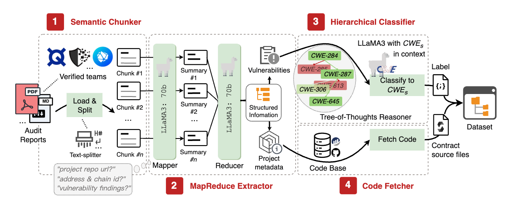
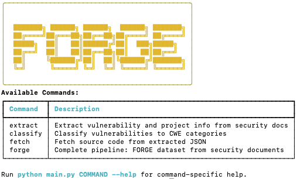
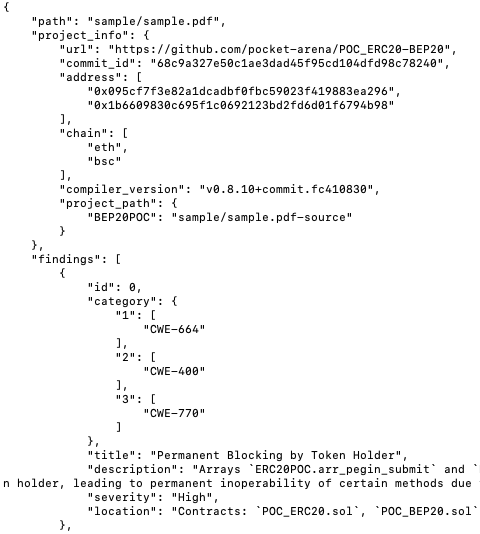

# FORGE-Artifact

This repository contains the artifacts for the paper "FORGE: An LLM-driven Framework for Large-Scale Smart Contract Vulnerability Dataset Construction."

Specifically, it includes the [source code](src/) of the FORGE framework, the [dataset](dataset/) constructed by FORGE, and the [evaluation results](evaluation/).

## References

For more information about the dataset and research findings, please refer to our paper accepted by **ICSE 2026**: "*FORGE: An LLM-driven Framework for Large-Scale Smart Contract Vulnerability Dataset Construction.*"


## FORGE Framework

### Overview

<p align="center">
  
</p>

FORGE is an automated framework that constructs comprehensive smart contract vulnerability datasets from real-world audit reports. By leveraging large language models (LLMs) and the Common Weakness Enumeration (CWE) standard, FORGE addresses key challenges in existing vulnerability datasets: labor-intensive and error-prone of manual construction, inconsistent classification standards, and limited scalability. The FORGE framework consists of four main modules:

- **Semantic Chunker**: Segments audit reports into meaningful, self-contained chunks
- **MapReduce Extractor**: Extracts and aggregates vulnerability information from report chunks
- **Hierarchical Classifier**: Classifies vulnerabilities into the CWE hierarchy using LLM by tree-of-thoughts reasoning
- **Code Fetcher**: Retrieves and integrates corresponding smart contract project source files


### Installation and Setup

We recommend using the [uv package manager](https://docs.astral.sh/uv/) for installing and configuring FORGE:

```bash
# Clone the repository
git clone https://github.com/FOGRE-security/FORGE-Artifact.git
cd FORGE-Artifact/src

# Install dependencies with uv
uv sync

# Configure model settings
vim config.yaml  # Configure LLM and provider API Baseurl

# Set up API keys
cp .env-example .env
vim .env  # Configure API-key
```

Alternatively, you can use pip:

```bash
# Install dependencies with pip
pip install -r requirements.txt
```

### Quick Start

Run the FORGE to extract, classify and fetch source code on a sample document:

```bash
# Using uv (recommended)
uv run main.py forge -t sample/sample.pdf -o sample

# Or using python directly
python main.py forge -t sample/sample.pdf -o sample
```

<p align="left">
  
</p>

---

<p align="left">
  
</p>


### Usage

FORGE offers several commands to run different parts of the pipeline:

```bash
# Extract vulnerability and project metadata from security documents:
uv run main.py extract -t path/to/documents -o output/directory
# Or: python main.py extract -t path/to/documents -o output/directory

# Classify extracted vulnerabilities into CWE categories:
uv run main.py classify -t path/to/extracted/json
# Or: python main.py classify -t path/to/extracted/json

# Fetch source code based on project metadata from *Github*, *Etherscan*, *Bscscan*, *Polygonscan* and *Basescan*.
uv run main.py fetch -t path/to/project/json
# Or: python main.py fetch -t path/to/project/json
```

#### Additional Options

All commands support the following options:
- `--log, -l`: Path to log directory (default: "logs")
- `--config, -c`: Path to config file (default: "config.yaml")

Run `python main.py COMMAND --help` for command-specific help.

---

## Dataset

We have made our dataset available in the following ways:

- **Vulnerability Information**: Available in the `dataset/results` directory of this repository.
- **Solidity Code Files**: Available in the `dataset/contracts` directory of this repository.
- **Audit Reports**: Due to GitHub storage limitations, these are hosted on Cloudflare R2 storage. You can download them using API tokens with any method you prefer. The `dataset/access_reports.ipynb` notebook provides a usage example.


---


## Evalulation

### RQ1

The dataset constructed by FORGE represents the most comprehensive collection of smart contract vulnerabilities to date, derived from real-world audit reports. Below is an overview of the dataset statistics:

| **Statistics** | **Numbers** |
|----------------|-------------|
| Total audit reports | 6,454 |
| Total DApp projects | 6,579 |
| Total solidity files | 81,390 |
| Average solidity files in a project | 12 |
| Average line of code in a project | 2,575 |
| **Compiler Versions** | ----|
| Compiler Version 0.4+ | 270 |
| Compiler Version 0.5+ | 478 |
| Compiler Version 0.6+ | 1,524 |
| Compiler Version 0.7+ | 360 |
| Compiler Version 0.8+ | 3,791 |
| Other Compiler Version | 31 |
| **Vulnerabilities** |---- |
| Total vulnerability findings | 27,497 |

The dataset contains 81,390 Solidity files and 27,497 vulnerabilities across 296 CWE categories, 59.0% of projects use the latest Solidity compiler version (0.8+). Average of 2,575 lines of code per project, representing real-world complexity.

You can use `RQ1/statistic.ipynb` to analyze and summarize the relevant data within our dataset.


### RQ2

The `evaluation/RQ2/` directory contains the results of our manual annotations for evaluating information extraction capabilities. You can calculate the precision, recall, and F1-score by running the command: `python calculate_metrics.py results.json`.

### RQ3

The `evaluation/RQ3/results.csv` file contains information on randomly sampled vulnerability findings, along with the CWE categories independently annotated by two human and those labeled by the LLM. The `evaluation/RQ3/k-alpha.csv` file is a formatted CSV template exported to meet the requirements of the [Krippendorff's Alpha Calculator](https://www.k-alpha.org/), which can be used to calculate the inter-rater agreement among the three annotators.

Additionally, the detailed information about the $CWE_s$ used for classification by FORGE's Hierarchical Classifier is stored in `evaluation/RQ3/CWE_s.json`.

### RQ4

The CWE classification results for vulnerability classifications by authors across 13 detection tools are stored in `evaluation/RQ4/tool_classifications.csv`. The `evaluation/RQ4/results.csv` file presents the outcomes of our analysis tools run on the dataset using the [SmartBugs](https://github.com/smartbugs/smartbugs) framework. Additionally, the `evaluation/RQ4/details` directory contains detailed metrics for each tool corresponding to each CWE category.

---


## Contributing

If you find any issues with the dataset or have questions, please contact shenym7@mail2.sysu.edu.cn or submit an issue to describe the problem. We will respond promptly and work to resolve it. You can also contribute to improving our code by creating a new pull request.